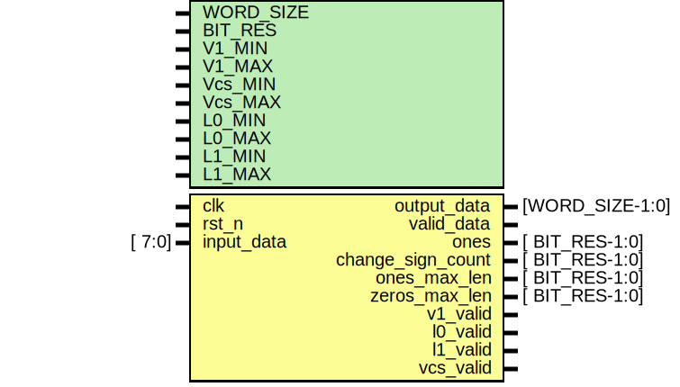

# Модуль: static_ctrl 

- **Файл**: static_ctrl.sv
## Диаграмма

## Параметры

| Название  | Тип | Значение          | Описание                     |
| --------- | --- | ----------------- | ---------------------------- |
| WORD_SIZE |     | 32                | Размер анализируемого слова  |
| BIT_RES   |     | $clog2(WORD_SIZE) | Количество бит для счетчиков |
| V1_MIN    |     | 100               | Ограничение для V1           |
| V1_MAX    |     | 156               | Ограничение для V1           |
| Vcs_MIN   |     | 100               | Ограничение для Vзп          |
| Vcs_MAX   |     | 156               | Ограничение для Vзп          |
| L0_MIN    |     | 4                 | Ограничение для L0           |
| L0_MAX    |     | 24                | Ограничение для L0           |
| L1_MIN    |     | 4                 | Ограничение для L1           |
| L1_MAX    |     | 24                | Ограничение для L1           |
## Порты

| Название          | Направление | Тип             | Описание                                |
| ----------------- | ----------- | --------------- | --------------------------------------- |
| clk               | input       |                 | Тактовая частота                        |
| rst_n             | input       |                 | Асинхронный сброс, активный 0           |
| input_data        | input       | [          7:0] | Входной байт                            |
| output_data       | output      | [WORD_SIZE-1:0] | Выходное слово                          |
| valid_data        | output      |                 | Валидность выходных данных              |
| ones              | output      | [  BIT_RES-1:0] | Количество единиц в слове               |
| change_sign_count | output      | [  BIT_RES-1:0] | Количество знакоперемен                 |
| ones_max_len      | output      | [  BIT_RES-1:0] | Максимальная длина подряд идущих единиц |
| zeros_max_len     | output      | [  BIT_RES-1:0] | Максимальная длина подряд идущих нулей  |
| v1_valid          | output      |                 | Соответствие условиям                   |
| l0_valid          | output      |                 | Соответствие условиям                   |
| l1_valid          | output      |                 | Соответствие условиям                   |
| vcs_valid         | output      |                 | Соответствие условиям                   |
## Сигналы

| Название          | Тип                          | Описание                         |
| ----------------- | ---------------------------- | -------------------------------- |
| valid_dl          | logic [DELAY-1:0]            | Регистры задержки для valid_data |
| data              | logic [WORD_SIZE-1:0]        | Регистр для слова                |
| data_dl           | logic [WORD_SIZE-1:0]        | Регистры задержки для слова      |
| shift_reg         | logic [                 7:0] |                                  |
| rx_cnt            | logic [$clog2(BYTE_CNT)-1:0] |                                  |
| ones_delay        | logic [BIT_RES-1:0]          |                                  |
| ones_wire         | logic [BIT_RES-1:0]          |                                  |
| change_sign_delay | logic [BIT_RES-1:0]          |                                  |
| change_sign_wire  | logic [BIT_RES-1:0]          |                                  |
## Константы

| Название   | Тип | Значение              | Описание                                                      |
| ---------- | --- | --------------------- | ------------------------------------------------------------- |
| BYTE_CNT   |     | WORD_SIZE / 8         | Количество байт                                               |
| DELAY      |     | $clog2(WORD_SIZE) - 1 | Задержка для сигнала valid_data                               |
| DATA_DELAY |     | $clog2(WORD_SIZE) - 2 | Задержка для данных                                           |
| ONES_DELAY |     | $clog2(WORD_SIZE) - 5 | Задержка для компенсации расчета кол-ва единиц и знакоперемен |
## Процессы
- data_delay: ( @(posedge clk or negedge rst_n) )
  - **Тип:** always_ff
- valid_delay: ( @(posedge clk or negedge rst_n) )
  - **Тип:** always_ff
- fill_reg: ( @(posedge clk or negedge rst_n) )
  - **Тип:** always_ff
## Подключенные модули

- ones_count_inst: ones_count
- change_sign_inst: change_sign
- ones_max_length_inst: ones_max_length
- zeros_max_length_inst: ones_max_length
